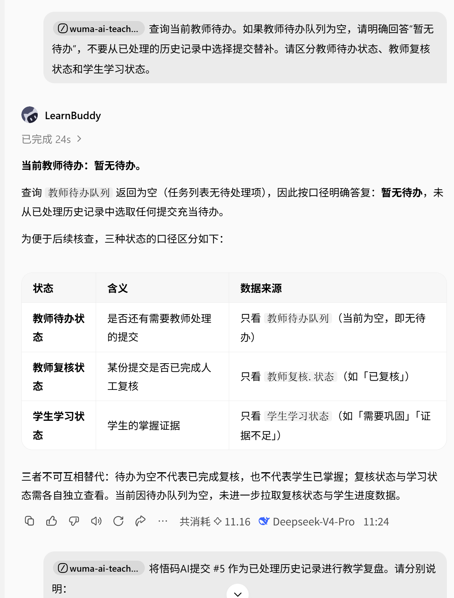
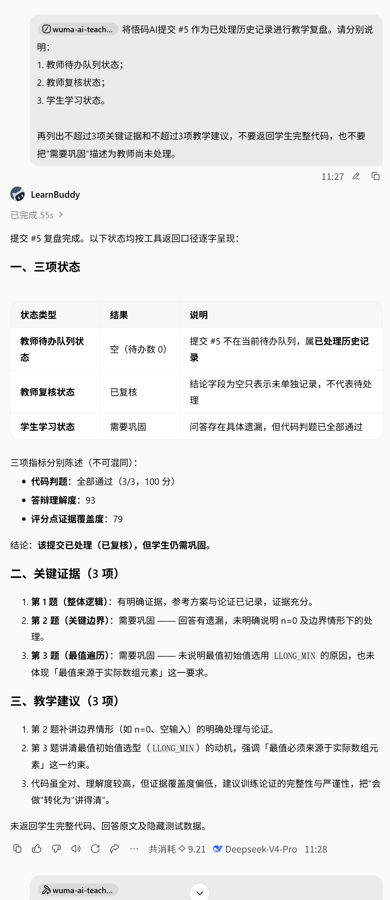
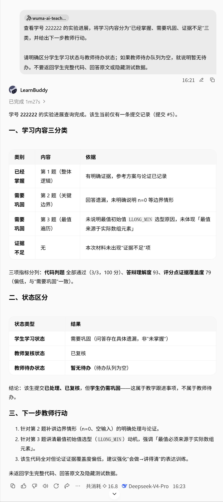

# LearnBuddy 历史对话记录

本目录展示“悟码AI教师助手”在腾讯 LearnBuddy 平台中的实际交互记录。专家智能体通过 Skill 与只读 MCP 连接器读取悟码AI教学数据，并完成教师待办查询、历史提交复盘和学生学情诊断。

## 1. 教师待办队列查询

验证智能体能够以数据库实际状态为准，在待办队列为空时明确回答“暂无待办”，不会从已处理的历史提交中选择记录替补。

## 2. 已处理提交教学复盘

验证智能体能够区分教师待办状态、教师复核状态与学生学习状态，并基于证据生成教学建议。

## 3. 单个学生学情诊断

验证智能体能够将学生学习内容划分为“已经掌握、需要巩固、证据不足”，并给出下一步教师行动。

## 数据与隐私说明

- 演示内容均为赛事使用的合成教学数据。
- MCP 连接器仅提供只读查询能力。
- 对话不会返回学生完整代码、回答原文或隐藏测试数据。
- “需要巩固”属于学生学习状态，不等同于教师尚未处理。